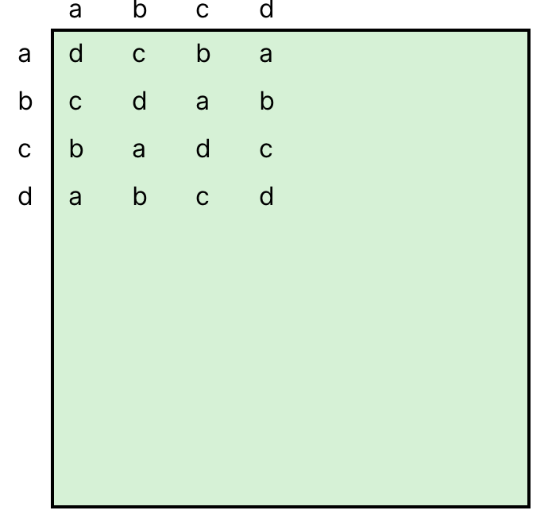
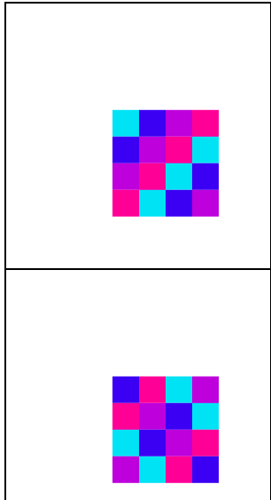
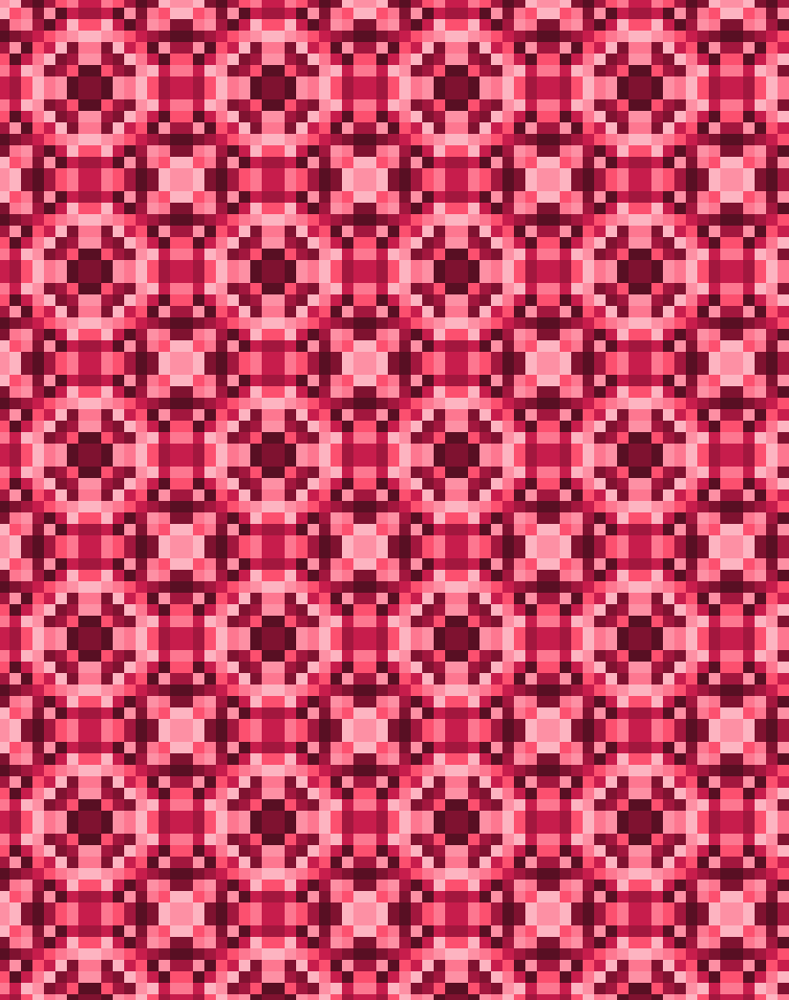
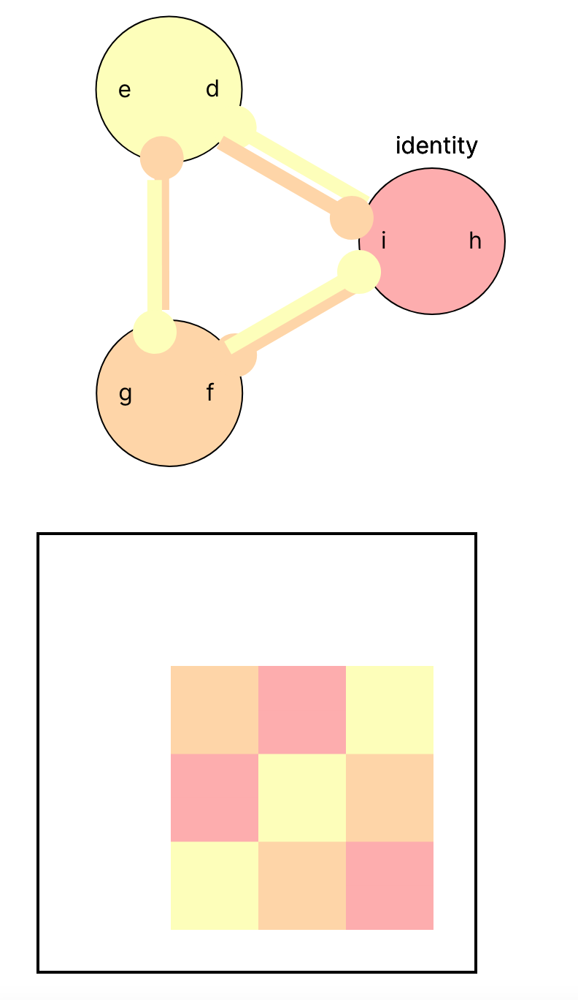
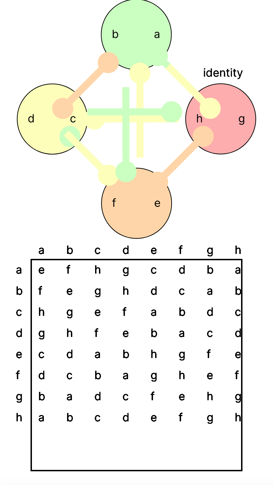
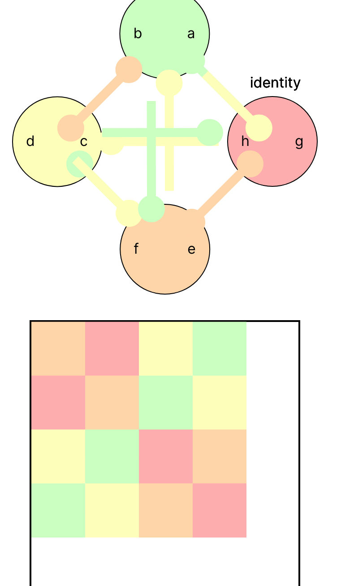
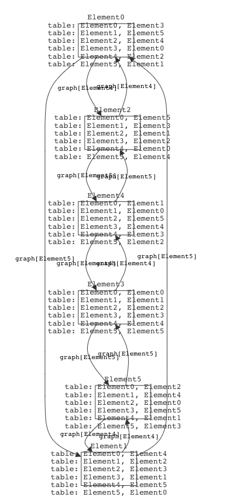

# Group Theory
- [Group Theory](#group-theory)
  - [What are we modeling?](#what-are-we-modeling)
  - [File Structure](#file-structure)
  - [Design Considerations](#design-considerations)
  - [Overview](#overview)
    - [Groups](#groups)
    - [Subgroups](#subgroups)
    - [Generators](#generators)
    - [Homomorphisms](#homomorphisms)
  - [Visualizers](#visualizers)
  - [List of Results](#list-of-results)
    - [Small propositions](#small-propositions)
    - [Lemmas](#lemmas)
    - [Theorems](#theorems)


## What are we modeling?

Group theory is a way of connecting and generalizing basic structures in mathematics and nature, especially those seen in numbers sets like the integers, geometry, and polynomials. As such, it holds an important role, both in abstract algebra and a wide array of mathematics. With this in mind, we have two goals:
- Model the notion of a group, and generate different groups using Forge.
- Show basic properties and theorems of groups hold for small-ordered finite groups.


## File Structure
Definitions<br/>
- [Group Definitions](https://github.com/YizhongHu/final_project/blob/master/group-defs.frg)
  * [Subgroups](https://github.com/YizhongHu/final_project/blob/master/subgroups.frg)
  * [Generators](https://github.com/YizhongHu/final_project/blob/master/generators.frg)
  * [Homomorphisms](https://github.com/YizhongHu/final_project/blob/master/homomorphisms.frg)
 
Propositions, Lemmas, and Theorems<br/>
- [Basic Propositions](https://github.com/YizhongHu/final_project/blob/master/basic-propositions.frg)

Testing<br/>
- [Tests](https://github.com/YizhongHu/final_project/blob/master/group-tests.frg)

## Design Considerations
There are various ways to approach group theory, whether that be in terms of content, which of the equivalent definitions to use, etc. As such, there have been many instances where we've had to weigh our options and choose a nonobvious solution.

For example, the `cyclic` predicate seemed easy to us, at least at first. We struggled with defining it in the obvious manner, but then we had the idea of using a different definition — a group is cyclic if and only if it has one generator. And this allowed us to write a simpler and cleaner version of the predicate. Here, we sacrificed efficiency for clarity.

While defining a normal subgroup, we also had many issues. We tried defining it as a subgroup where the set of left cosets and the set of right cosets are equal. While this was easier to write, since we already defined cosets, it was quite inefficient. So we decided to consider the many alternative definitions of a normal group, finally landing on the definition concerning invariance under conjugation. Here, we sacrificed clarity for efficiency.

While we made serious efforts to optimize our code, we generally favored clarity and rigor over efficiency, but looked for balances when appropriate. Since correct and memorable definitions are important in building up any mathematical topic, we wanted our definitions to be readable (less field/set-table notation and more math-adjacent syntax) and consistent.

We tried to expand topics around homomorphisms, but ultimately felt bounded by first order logic. When we started, we didn't realize how much the study of homomorphisms relied on 'there is some homomorphism...' or 'all homomorphisms...,' which quantifies over functions, and thus exists above us in second order logic. Regardless, we were able to define homomorphisms and show whether a function we give is a homomorphism or not.

Our goal originally was to explore and prove things about small-ordered groups. We were successful in doing this, but we stumbled across something pedagogical in the process. The visualizations we created conjured a new way of understanding groups. We were able to understand deeper structures in many groups by looking at the colored Cayley tables, quotient groups, and generator notation. That is to say, not only did we learn a lot about groups, but we also learned a new way to think about groups.
## Overview
The following is an explanatory overview of the code.
### Groups
A **group** (`Group`) is a set (of `Element`) together with a binary operation (`table`) that acts on the set, which satisfies three axioms:
- Identity: (`haveIdentity`) The group contains an element *e* such that for all *g* in the group, *ge = eg = G*.
- Inverse: (`haveInverse`) Each element in the group has an inverse, i.e. for each element *g*, there is a *g⁻¹* such that *gg⁻¹ = 1*.
- Associativity: (`associativity`) For all elements *g₁, g₂, g₃ ∈ G*, it holds that *g₁(g₂g₃) = (g₁g₂)g₃*.<br/><br/>
These axioms bestow a sense of structure on the set. Some common examples of finite groups are the set of integers modulo some number with addition, the set of permutations of a set with the operation of doing one permutation after the other, and the set of symmetries of a polygon. We'll define some terminology that will prove useful:

<div align="center">
 
| Term    | Forge Pred |                                          Definition                                           |                Example |
| :------ | :--------: | :-------------------------------------------------------------------------------------------: | ---------------------: |
| Abelian | `abelian`  |   An abelian group is a commutative group, <br/>i.e. *g₁ * g₂ = g₂ * g₁* for all *g₂, g₁*.    |      Integers mod 5, + |
| Cyclic  |  `cyclic`  |             A cyclic group is a group that can be generated<br/> by one element.              |      Integers mod 5, + |
| Order   |  `order`   | The order of a group *G* (denoted *\|G\|*) is the<br/> number of elements in the group's set. | \|Integers mod 5\| = 5 |
 
</div>

### Subgroups
After defining group axioms and properties, it's not a far step to let ourselves be curious about subsets of groups. We'll define the notion of subsets of a group which also abide by the group axioms as a **subgroup**. In fact, we can be more minimal about our definition:
```
pred subgroup[H: Group, G: Group] {
    subset[H, G]
    closed[H]
    identity[G] in H.elements
}
```
I.e., we only need to ensure that *H* is a subset of *G*, is closed, and contains the identity of *G*. <br/>
As an immediate result, we can show Lagrange's theorem. This is typically done by first building up the notion of a coset, but we can test it exhaustively on small-ordered groups. <br/>
We can now define **cosets**, which, when given a group `G` and a subgroup `H` of `G`, gives the set of all elements of `H` multiplied by some `a ∈ G`. We define the left and right cosets seperately: `leftCoset` and `rightCoset`.<br/>
A **normal subgroup** is a subgroup invariant under conjugation, i.e.,
```
pred normalSubgroup[H, G: Group] {
    subgroup[H, G]
    all g : G.elements | all h : H.elements {
        G.table[G.table[g, h], rightInverse[g, G]] in H.elements
    }
}
```
We can then say that a simple group (`simple`) is a group with no non-trivial normal subgroups, and a Dedekind group (`dedekind`) is a group where all subgroups are normal.<br/>
All of this builds up to the notion of a quotient group. A **quotient group** (`QuotientGroup`) is a group constructed by taking a normal subgroup and all of its cosets as elements, which together are called residue classes, and having the operation between these elements be that of the original group. We do this by extending the `Element` sig to a `ResidueClass` sig, which has a field containing `Element`s. We constrain this field to contain only non-`ResidueClass` elements of the given group, and ensuring that it adheres to the constraints of quotient groups.

### Generators

A generating set (`Generator`) is a
subset of the group that can reach every element in the
group from the identity through right multiplication of
 either a member of the generating set or its inverse.
 For finite groups, this definition is equivalent to 
 that without inverses.

A trivial generating set is just the group itself, but 
that does not tell us much about the structure of the
group. A **minimal generating set** is a generating set
where all generators cannot be generated by a combination 
of other generators. There may be multiple minimal
generating sets, and they may not be the same size.
When the generating set with the minimum number of 
elements has only one element, the group is considered
cyclic.

Additionally, if we represent right operation by a generator 
as an edge between two group elements, we can draw a **Cayley 
Graph**. We can associate to each element of the group a node 
(`ElementNode`), and build up some graph theoretic tools to 
understand Cayley graphs of groups. For instance, we can check 
to see if a graph is planar.

Call *ρ(Γ)* the *potential genus* of a group *Γ* if *ρ(Γ) = 𝛾(Cₛ(Γ))*
for a minimal generating set *S* that yields maximal genus. In other words, take the 
Cayley graphs of all minimal generating sets of *Γ*; then *ρ(Γ)* is the 
 maximum genus across all of those graphs. By letting Forge 
exhaustively check small-ordered Cayley graphs, we find that the only 
graph such that *ρ(Γ) ≠ 0* is the quaternion group, which has 8 
elements where *ρ(Γ) = 1*.
 
### Homomorphisms
A natural next step when dealing with groups might be wondering how different (or secretly the same!) groups relate to each other. This is the motivation behind homomorphisms. A **group homomorphism** is a map between two groups which maintains the algebraic structure of the domain. Formally, for groups G and H, φ: G → H such that for g₁, g₂ ∈ G, φ(g₁ ⋆ g₂) = φ(g₁) ⬝ φ(g₂). We can classify homomorphisms based on how they relate their domain and codomain:

<div align="center">

| Term         |   Forge Pred   |                                                                           Definition                                                                            |
| :----------- | :------------: | :-------------------------------------------------------------------------------------------------------------------------------------------------------------: |
| Monomorphism |  `injective`   |                                  A monomorphism is an injective homomorphism, i.e. one that guarentees<br/> a 1-to-1 mapping.                                   |
| Epimorphism  |  `surjective`  |                           An epimorphism is a surjective homomorphism, i.e. one such that the <br/> codomain is the image of the map.                           |
| Isomorphism  | `isomorphism`  | An isomorphism is an injective and surjective homomorphism. If there<br/> exists an isomorphism between two groups, then those groups are equal, up to notaion. |
| Endomorphism | `endomorphism` |                                                   An endomorphism is a homomorphism from a group onto itself.                                                   |
| Automorphism | `automorphism` |                                                          An automorphism is a bijective endomorphism.                                                           |

</div>
 
## Visualizers
To make understanding Forge's output easier, we've included two visualizers:
- [Cayley Table Visualizer](https://github.com/YizhongHu/final_project/blob/master/visualization/group-viz.js)<br/>
  This visualizer displays the Cayley table of all groups in the instance. The output is read as the cell in row *i* and column *j* is *i ⬝ j*. At the top of the script, there are two variables the user can manually change: the `DISPLAY_TYPE` and `COLOR_SCHEME` variables. Setting the former to `"colors"` removes the letters and replaces them with colored rectangles, where each element has a unique color. Changing `COLOR_SCHEME` to `"normal"`, `"pastel"`, `"ruby"`, or `"sandstone"` changes the color scheme. The following are some example outputs:<br/>
 <p align="center">
  
  
 <p/>
 
- [Cayley Tile Visualizer](https://github.com/YizhongHu/final_project/blob/master/visualization/tiling-viz.js)<br/>
  This visualizer displays a tiling of the colored Cayley table. Specifically, the colored Cayley table is reflected twice 
  to get a 2-table-by-2-table block, which is then translated across the plane. The user can manually change the `COLOR_SCHEME` 
  variable to change the color scheme, and the `SCALE` variable to zoom in and out. The following are some cool example outputs:<br/>
  <p align="center">
   
  
  
  <p/>

- [Quotient Group Visualizer](https://github.com/YizhongHu/final_project/blob/master/visualization/quotient-viz.js)<br/>
This visualizer displays a `QuotientGroup` sig and the Cayley table of the `Group` that it comes from (the unquotiented group). Each circle is a residue class, and the "arms" extending from each of the circles represents the relationship between residue classes (the circle at the end of an arm is the "hand", so each arm belongs to the circle which is closest to its flat end). A circle of color *X* with an arm of color *Y* grabbing on to a group of color *Z* means that for all *x ∈ X*, *y ∈ Y*, there is some *z ∈ Z*, such that *x ⬝ y = z*.</br>
There are variables `DISPLAY_TYPE`, which can be changed to "letters" or "colors", changing the Cayley table; and `BOX_STROKE`, which can be set to increase the cell-borders of the Cayley table when "colors" is selected to reveal the original group inside the quotiented group. The following are some interesting outputs:</br>
<p align="center">
   
  
  
 <p/>
Notice something interesting about the colored Cayley table: because the quotient needs to be isomorphic to a group, each residue class forms a block in the quotiented table (e.g. in the first image above, each colored cell of the table is actually a 2x2 of smaller cells of the unquotiented group). This gives us a geometric proof of Lagrange's theorem for normal subgroups, i.e. the order of a normal subgroup must divide the order of the group.
<details>
<summary>Why?</summary>
<br>
Consider what would happen if the order of a normal subgroup didn't divide the order of the group. Let <i>Q = G/N</i> be the quotient group made by modding <i>G</i> by the normal subgroup <i>N</i>, and say <i>N</i> has an order <i>n</i> that doesn't divide the order of <i>G</i>, <i>g</i>. Because each coset of <i>N</i> would be the same size, the Cayley table of <i>Q</i> would be divided equally (the cosets can't overlap) into <i>n x n</i> squares. Since we can't divide a <i>g x g</i> square equally into <i>n x n</i> squares, this is a contradiction.
</details>
<br/>


- [Cayley Graph Visualizer](ttps://github.com/YizhongHu/final_project/blob/master/visualization/cayleyGraph.json)<br/>
We can generate a Cayley Graph with the generator syntax. As we discussed, 
each directed edge in the Cayley Graph shows a generator operation from 
one group element to another. We can use Sterling to help us see a Cayley
Graph. First, we need to load `generator.frg`. We then need to constrain 
`validGenerators` which makes sure that the generators and graphs are 
properly constrained. We then run some instance in Sterling. Once the group
instance is shown on Sterling, select `Group` in time series projection.
Then, in themes, load `cayleyGraph.json`. This makes sure that only
the Cayley Graph edges are shown. 

<p align="center">
   
 <p/>

 In this example, we have the Cayley Graph of S6. It has two generators,
 `Element4` and `Elemenet 5`. The graph is connected by these two generators,
 and there is only one way to get from one node to the other.

## List of Results
The following is a list of propositions, lemmas, and theorems that we've "proved" to hold (at least for finite groups of low order). Let *G* be a group, *H* a subgroup, *g*, *gᵢ* ∈ *G*, *h*, *hᵢ* ∈ *H*.

### Small propositions
- *G* has only one identity element.
- The identity element commutes.
- For all *g*, *g⁻¹* is unique.
- The inverse of *g* commutes with *g*.
- All subgroups are groups.
- All subgroups are closed.
- The identity of *G* is in *H*.
- If *h ∈ H*, then *h⁻¹ ∈ H*.
- *G* and *{id}* are subgroups of *G*.
- Both *G* and *{id}* are normal.
- *A₃* as a subgroup of *S₃* is normal.

### Lemmas
- All cyclic groups are abelian.
- All abelian groups are Dedekind groups.

### Theorems
- Lagrange's Theorem: |H| divides |G|
- The quaternion group is the group of smallest order with potential genus of 1.
<!-- ## TODOs
Updated 4.23.22
- group-defs.frg
  * [ ] symmetric pred
  * [ ] permutation pred
  * [ ] (maybe) simpler cyclic pred
  * [x] visualization for Cayley table
- subgroups.frg
  * [ ] write todo list for subgroups.frg  :)
- generators.frg
  * [ ] tests + examples
  * [ ] visualization for Cayley graph
- homomorphisms.frg
  * [ ] fix inj <=/=> ker = {id} issue
  * [ ] tests + examples
  * [ ] visualization
  * [ ] look into showable theorems
- overall
  * [ ] think about optimization?
  * [ ] dip our toes into rings?
  * [ ] refactor and fix tests -->

<!-- - [x] Write predicates representing the group axioms: identity, inverse, associativity. Then write
   predicates that represent useful properties: abelian, cyclic, symmetric, permutation groups
- [x] Simple propositions/preds that we can show hold true:
    a. The identity element is unique
    b. Each element has only one inverse
    c. If g, h ∈ G, then (gh)⁻¹ = h⁻¹g⁻¹
    d. If g ∈ G, then (g⁻¹)⁻¹ = g
- [ ] [If we have time] homomorphisms - a lot comes out of group isomorphisms
- [x] Define subgroups
- [x] Simple propositions/preds that we can show hold true for subgroups:
    Let H be a subgroup
    a. For each h₁, h₂ ∈ H, h₁h₂ ∈ H
    b. e ∈ H
    c. if h ∈ H, then h⁻¹ ∈ H
    d. G and {e} are subgroups
- [ ] Theorems
  • Lagrange's Theorem: If H ⊂ G is a subgroup, then the order of H divides G, i.e. |H| | |G|
  • If G is a finite group of order p² for some prime number p, then G is abelian
  • If Sₙ is the permutation group of {1,...,n}, then for n ≥ 3, Sₙ is non-abelian
  • First Sylow Theorem: If G is a finite group such that pⁿ | |G| for a prime p, then there
      exists a subgroup S ⊆ G such that |S| = pⁿ -->
